# Task2

# Image Dithering

## David

| Effect type | Image                         |
| :---        | :---:                         |
| original    |  |
| threshold   |  |
| random      |  |
| ordered     |  |
| error diffusion |  |
| floyd       |  |

## Woman

| Effect type | Image |
| :--- | :---: |
| original |  |
| threshold |  |
| random |  |
| ordered |  |
| error diffusion |  |
| floyd |  |

## Gradient-h

| Effect type | Image |
| :--- | :---: |
| original |  |
| threshold |  |
| random |  |
| ordered | 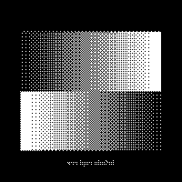 |
| error diffusion | 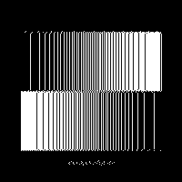 |
| floyd | 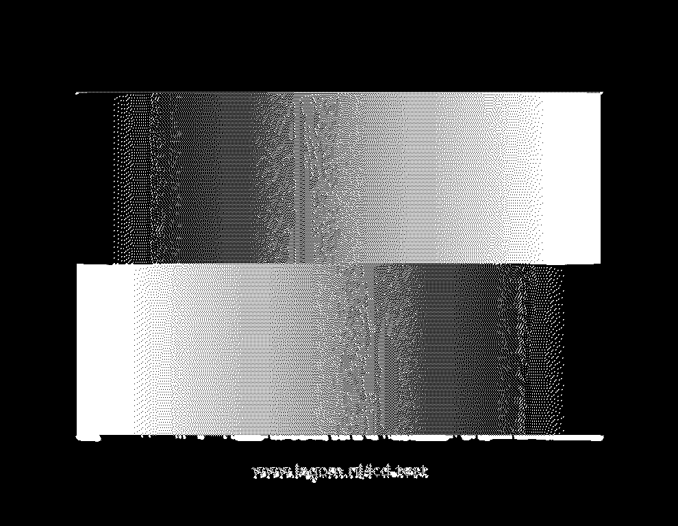 |

## Kodim08

| Effect type | Image |
| :--- | :---: |
| original |  |
| threshold | 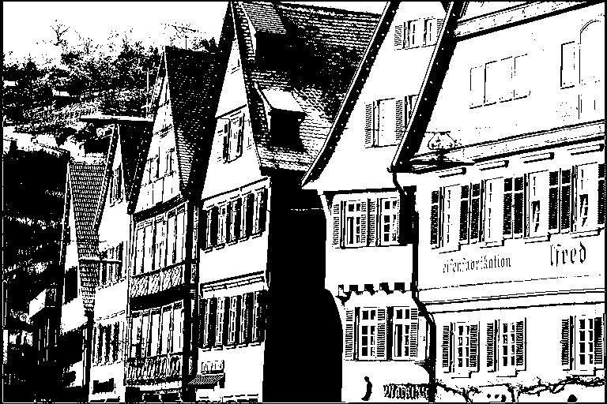 |
| random | 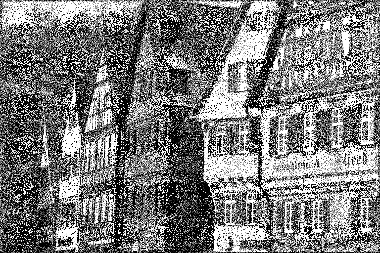 |
| ordered | 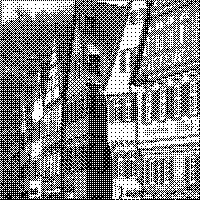 |
| error diffusion | 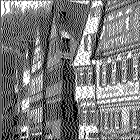 |
| floyd | 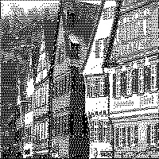 |

## Kodim15

| Effect type | Image |
| :--- | :---: |
| original |  |
| threshold | 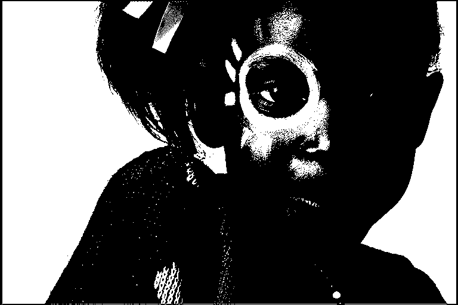 |
| random | 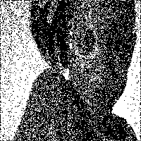 |
| ordered | 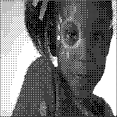 |
| error diffusion | 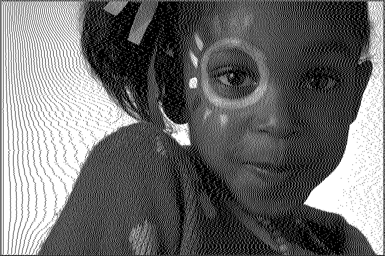 |
| floyd | 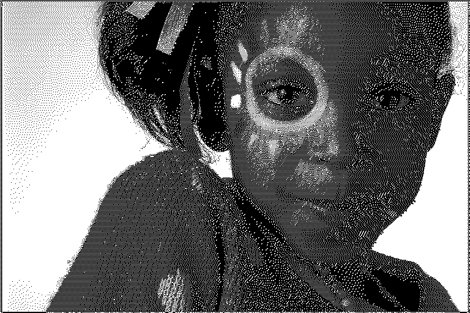 |
