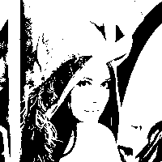
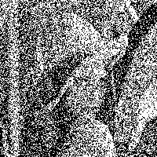
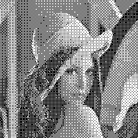

# Task2

# Image Dithering

## David

* original

* threshold

* random

* ordered

* error diffusion

* floyd

## Woman

* original

* threshold

* random

* ordered

* error diffusion

* floyd

